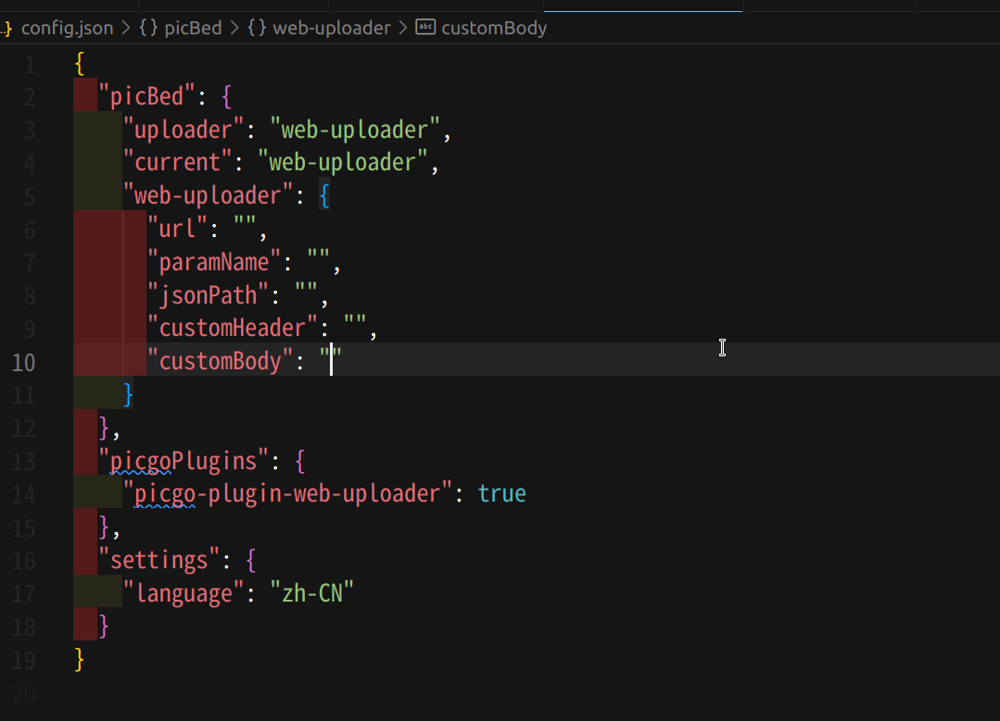
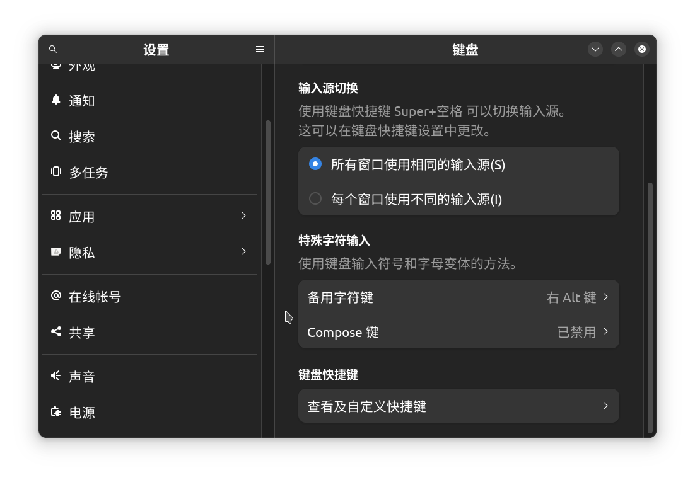
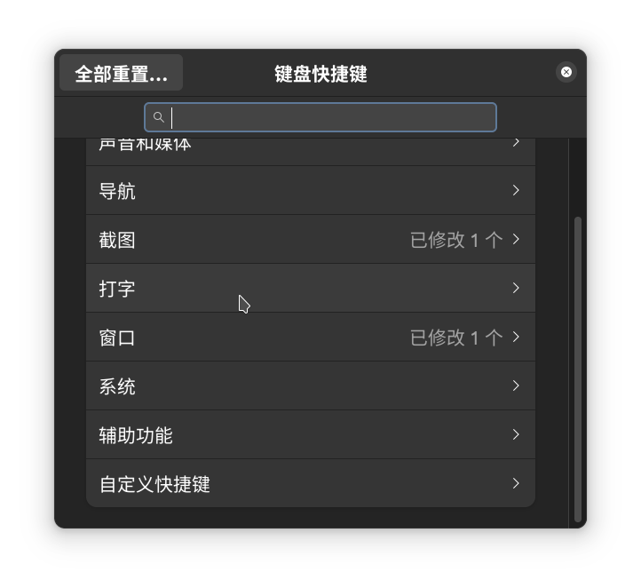
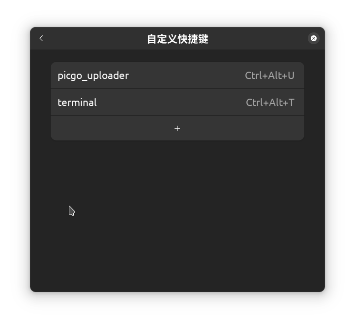
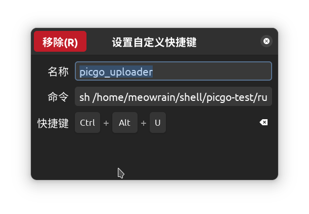
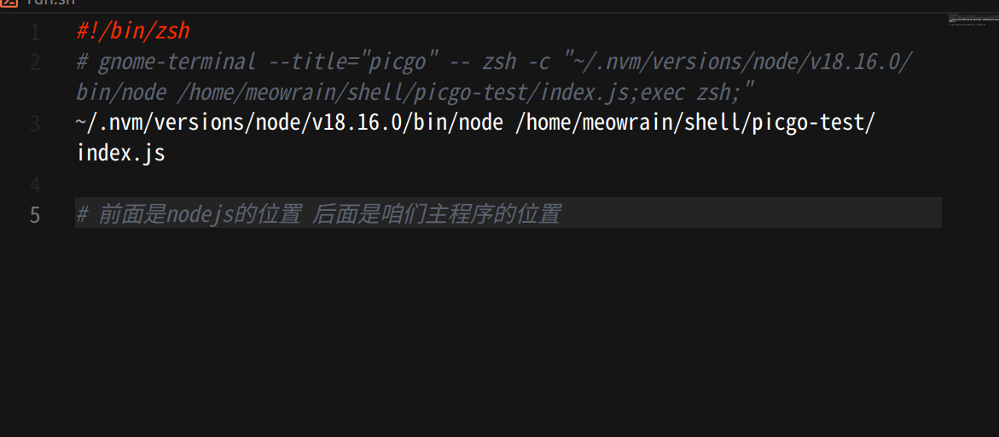
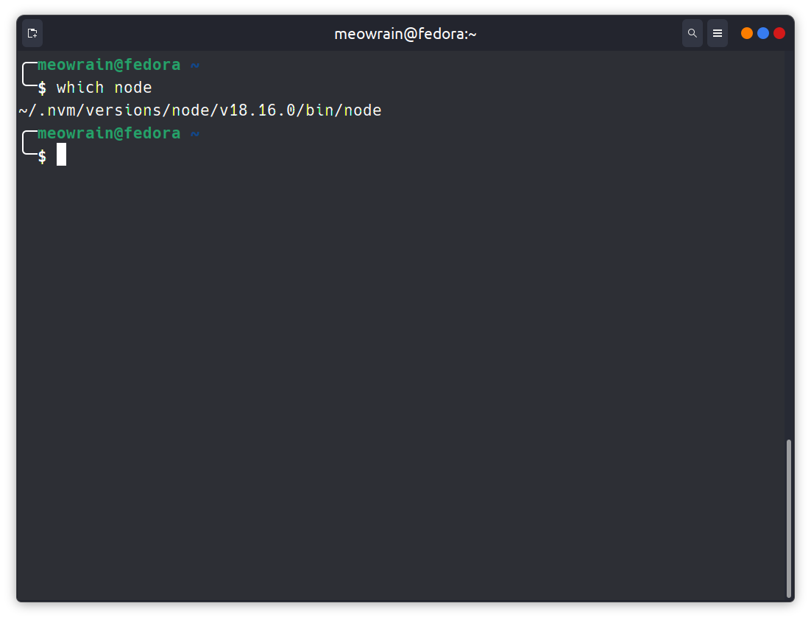
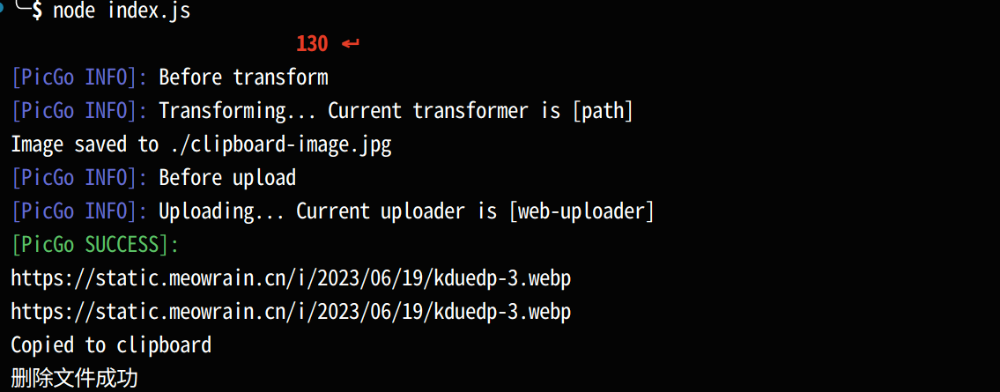
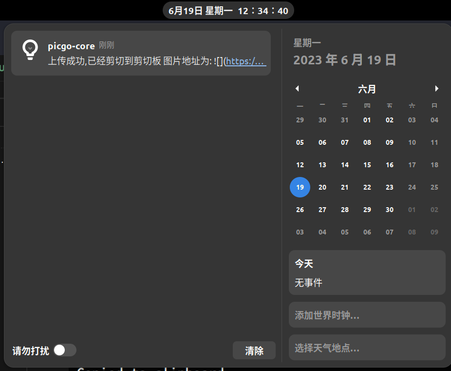

# picgo-core快捷键上传剪切板图片到自定义图床程序(Linux wayland版本)
## 目录
- [picgo-core快捷键上传剪切板图片到自定义图床程序(Linux wayland版本)](#picgo-core快捷键上传剪切板图片到自定义图床程序linux-wayland版本)
  - [目录](#目录)
  - [初衷](#初衷)
  - [使用方法](#使用方法)
    - [克隆仓库](#克隆仓库)
    - [安装包](#安装包)
    - [配置config.json](#配置configjson)
    - [设置快捷键](#设置快捷键)
    - [修改run.sh脚本](#修改runsh脚本)
  - [使用](#使用)
    - [使用展示图](#使用展示图)

## 初衷

>  写这个程序的初衷,其实就是我不想用picgo官方的electron写的图形程序,但是提供的picgo-core终端程序也不能用快捷键
>
> 而我用的是fedora,Gnome wayland桌面环境,想把剪切板图片上传到自己的图床就只能自己写个脚本了

## 使用方法
### 克隆仓库
这个不用说
`git clone 仓库地址` 就行了
### 安装包

```shell
npm i
```

### 配置config.json

自己修改就行了

### 设置快捷键




### 修改run.sh脚本
因为这个程序想运行,得调shell脚本,所以就写了个 `run.sh`


拿到咱们nodejs的位置,用下面的命令

```shell
which node
```

就能拿到咱们的node位置了

替换`run.sh`中的内容就行了

## 使用
咱们截图后直接`ctrl + alt + u ` 就行了

### 使用展示图




